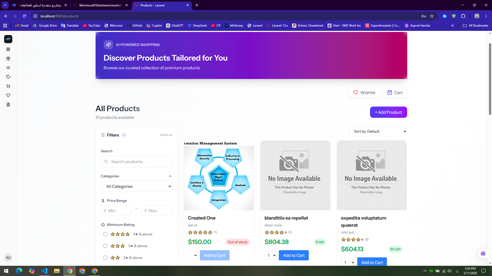
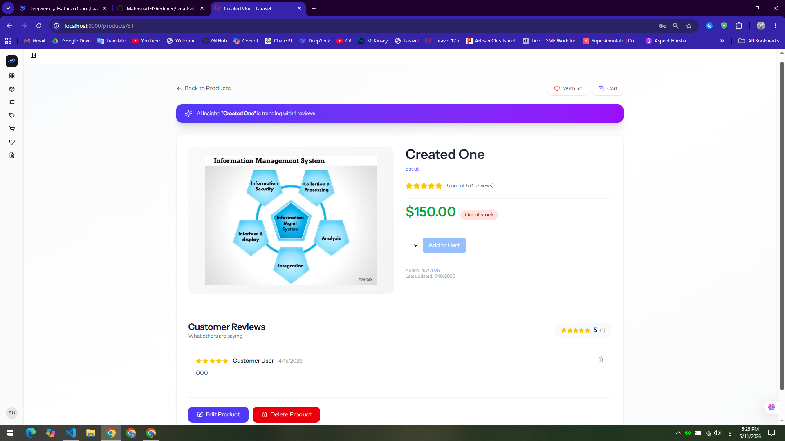
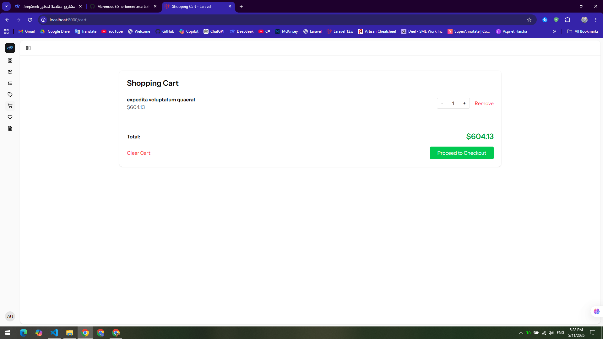
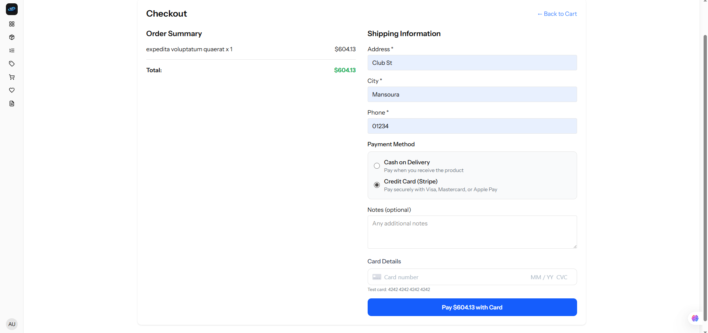
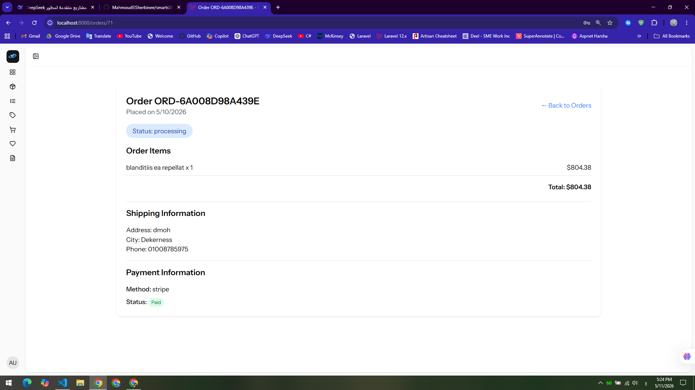
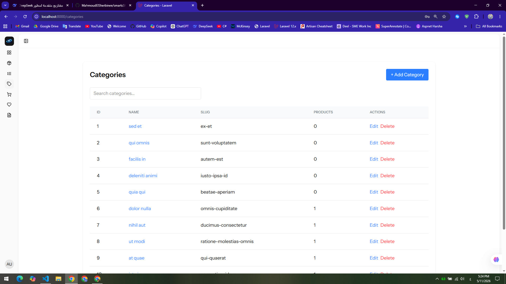
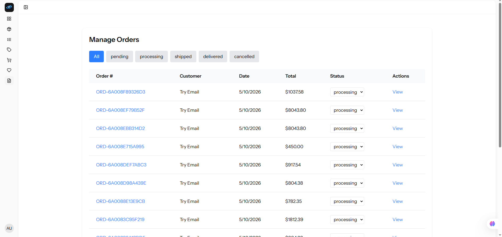
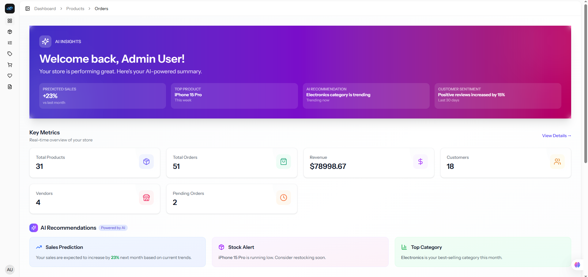

[](https://php.net)
[](https://laravel.com)
[](https://reactjs.org)
[](https://typescriptlang.org)
[](https://opensource.org/licenses/MIT)
[](https://stripe.com)


# 🛒 SmartShop Pro - E-Commerce Platform

A full-featured e-commerce platform built with **Laravel 12**, **React**, **TypeScript**, and **Inertia.js**.

## ✨ Features

### 👥 User Roles
- **Admin**: Full control over products, categories, orders, and users
- **Vendor**: Manage their own products and view sales
- **Customer**: Browse, purchase, review, and save favorite products

### 🛍️ Shopping Features
- Product browsing with categories and search
- Shopping cart with quantity management
- Checkout with multiple payment methods
- Order tracking and history
- Stock management (auto-update on purchase)

### 💳 Payment System
- **Cash on Delivery (COD)** - Pay when you receive
- **Stripe Integration** - Credit card payments
- Secure webhook handling for payment confirmation

### ⭐ Additional Features
- Product reviews and ratings (1-5 stars)
- Wishlist - Save products for later
- Product images upload
- Responsive design with Tailwind CSS

### 📊 Dashboard
- **Admin**: Sales reports, order management, user overview
- **Vendor**: Product analytics, sales statistics
- **Customer**: Order history, total spent

## 🛠️ Tech Stack

| Category | Technologies |
|----------|-------------|
| **Backend** | Laravel 12, PHP 8.2+ |
| **Frontend** | React 18, TypeScript, Inertia.js |
| **Styling** | Tailwind CSS |
| **Database** | MySQL |
| **Payments** | Stripe API |
| **Authentication** | Laravel Fortify + Sanctum |


## 📸 Screenshots

### 🛍️ Products Page (AI-Powered)


### 📦 Product Details


### 🛒 Shopping Cart


### 💳 Checkout with Stripe


### 📋 Orders Management


### 🏷️ Categories Management (Admin)


### 📊 Admin Dashboard with AI Insights


### 🔮 AI-Powered Admin Dashboard



## 🏗️ Architecture

```
├── app/
│   ├── Enums/              # OrderStatus, UserType
│   ├── Models/             # User, Product, Order, Category, Review, Wishlist
│   ├── Policies/           # Authorization rules
│   ├── Services/           # Business logic (OrderService, StripeService)
│   ├── Http/
│   │   ├── Controllers/
│   │   └── Requests/       # Form validation
├── database/
│   ├── migrations/
│   └── seeders/
├── resources/js/
│   ├── Pages/              # React pages
│   ├── Components/         # Reusable components
│   └── layouts/
└── routes/
    ├── web.php             # Inertia routes
    └── api.php             # REST API routes
```

## 🚀 Installation

### Prerequisites
- PHP >= 8.2
- Composer
- Node.js >= 18
- MySQL

### Steps

```bash
# 1. Clone the repository
git clone https://github.com/yourusername/smartshop-pro.git
cd smartshop-pro

# 2. Install dependencies
composer install
npm install

# 3. Environment setup
cp .env.example .env
php artisan key:generate

# 4. Database setup
php artisan migrate --seed

# 5. Storage link (for images)
php artisan storage:link

# 6. Build frontend
npm run build

# 7. Run the application
php artisan serve
npm run dev
```

### Stripe Configuration

1. Create a Stripe account at [stripe.com](https://stripe.com)
2. Get your API keys from Dashboard → Developers → API Keys
3. Add to `.env`:

```env
STRIPE_KEY=pk_test_xxx
STRIPE_SECRET=sk_test_xxx
STRIPE_WEBHOOK_SECRET=whsec_xxx
```

4. Set up webhook:

```bash
stripe listen --forward-to http://localhost:8000/stripe/webhook
```

## 🔑 Default Users (after seeding)

| Role | Email | Password |
|------|-------|----------|
| **Admin** | admin@smartshop.com | password |
| **Vendor** | vendor@smartshop.com | password |
| **Customer** | customer@smartshop.com | password |

## 📁 Project Structure

```
smartshop-pro/
├── app/
│   ├── Http/Controllers/
│   │   ├── ProductController.php
│   │   ├── CategoryController.php
│   │   ├── OrderController.php
│   │   ├── CartController.php
│   │   ├── WishlistController.php
│   │   └── ReviewController.php
│   ├── Models/
│   ├── Services/
│   │   ├── OrderService.php
│   │   └── StripeService.php
│   └── Policies/
├── database/
│   ├── migrations/
│   └── seeders/
├── resources/js/
│   ├── Pages/
│   │   ├── Products/
│   │   ├── Categories/
│   │   ├── Cart/
│   │   ├── Orders/
│   │   ├── Wishlist/
│   │   └── Admin/
│   └── Components/
└── routes/
```

## 🤝 Contributing

1. Fork the repository
2. Create a feature branch (`git checkout -b feature/amazing`)
3. Commit changes (`git commit -m 'Add amazing feature'`)
4. Push to branch (`git push origin feature/amazing`)
5. Open a Pull Request

## 📄 License

This project is open-sourced software licensed under the [MIT license](https://opensource.org/licenses/MIT).

## 👨‍💻 Author

**Mahmoud El-Sherbine**

- Email: mahmoudsherbine168@gmail.com
- GitHub: [@mahmoud-sherbine](https://github.com/mahmoudelsherbinee)
- LinkedIn: [Mahmoud El-Sherbine](https://www.linkedin.com/in/mahmoud-el-sherbinee)

---

## ⭐ Show Your Support

```
If you found this project helpful, please give it a ⭐ on GitHub!
---
